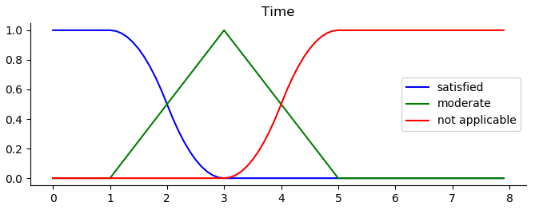
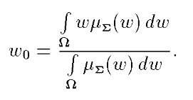

# ОПИСАНИЕ ЗАДАЧИ:
В ходе реализации проекта возникает необходимость внесения изменения в проект. Вариантов изменения может быть несколько. Каждый вариант предполагает свои оценки изменений в деньгах и сроках, необходимые для выполнения каждого варианта изменения.

Учет рисков. Если для варианта изменения проекта есть какие-либо риски (например, необходимо изменение требования Заказчика), то при сравнении вариантов мы указываем, наличие рисков.
## ЗАДАЧА:
С помощью аппарата «нечеткой» логики реализованного при помощи алгоритма Мамдани необходимо количественно оценить предложенные варианты решений, и дать рекомендации по выбору наилучшего решения.
## РЕШЕНИЕ:
Характеристические функции:.

1.	«деньги», млн. = {0, 1, 2, 3, 4, 5, 6, 7, 8, 9, 10, 13}

S = {«Не страшно», «Возможно», «Не приемлемо»}

2.	«Время», мес. = {0, 1, 2, 3, 4, 5, 6, 7}

T = {«Не страшно», «Возможно», «Не приемлемо»}

3.	«Решения», %  = {0 - 100}

R = {«Отказаться с уверенностью», «Отклонить для пересмотра», «Принять с ограничениями», «Принять с осторожностью», «Точно принять»}

Для каждого варианта изменения проекта предоставлены входные данные (в случае принятия этого решения) в виде денег (s0) и времени (t0). Это входные данные для принятия решения (r0).

Пример записи правила.
> Если деньги по затратам на данное изменение попадают в категорию «Не страшно» и время затраченное на изменение попадает в категорию «Не страшно», то наше решение попадает в категорию «Точно принять»
Такое правило запишем следующим образом: Если s0 = S1 и t0 = T1, то r = R5

Правила:

| Риска нет | Риск есть |
|-----------|-----------|
| 1. Если s0 = S1 и t0 = T1, то r = R5 | 1. Если s0 = S1 и t0 = T1, то r = R4 |
| 2. Если s0 = S1 и t0 = T2, то r = R4 | 2. Если s0 = S1 и t0 = T2, то r = R3 |
| 3. Если s0 = S1 и t0 = T3, то r = R2 | 3. Если s0 = S1 и t0 = T3, то r = R1 |
| 4. Если s0 = S2 и t0 = T1, то r = R4 | 4. Если s0 = S2 и t0 = T1, то r = R3 |
| 5. Если s0 = S2 и t0 = T2, то r = R3 | 5. Если s0 = S2 и t0 = T2, то r = R2 |
| 6. Если s0 = S2 и t0 = T3, то r = R2 | 6. Если s0 = S2 и t0 = T3, то r = R1 |
| 7. Если s0 = S3 и t0 = T1, то r = R2 | 7. Если s0 = S3 и t0 = T1, то r = R1 |
| 8. Если s0 = S3 и t0 = T2, то r = R2 | 8. Если s0 = S3 и t0 = T2, то r = R1 |
| 9. Если s0 = S3 и t0 = T3, то r = R1 | 9. Если s0 = S3 и t0 = T3, то r = R1 |

## ПРИМЕР
### Дано:
Для изменения 1 нам необходимо 3,5 млн. и 2 мес. (s0 = 3.5 t0 = 2) (рисков нет)
Для изменения 2 нам необходимо 0,5 млн. и 4 мес. (s0 = 0.5 t0 = 4) (риск есть)
### Вопрос:
Какой вариант выбрать?
### Решение:
Просчитаем оба варианта с помощью «нечеткой» логики и выберем оптимальный вариант.

Рассчитываем вариант 1 (s0 = 3.5, t0 = 2, рисков нет).
1)	α1 = min (0.5, 0,5) = 0.5    ˄   R5
2)	α2 = min (0.5, 0.5) = 0.5    ˄   R4
3)	α3 = min (0.5, 0) = 0          ˄   R2
4)	α4 = min (0.5, 0.5) = 0.5    ˄   R4
5)	α5 = min (0.5, 0.5) = 0.5    ˄   R2
6)	α6 = min (0.5, 0) = 0          ˄   R2
7)	α7 = min (0, 0.5) = 0          ˄   R2
8)	α8 = min (0, 0.5) = 0          ˄   R2
9)	α9 = min (0, 0) = 0             ˄   R1

Для нахождения r0 необходимо провести дефазификацию, например центроидным методом по формуле:

Это можно сделать с помощью библиотеки sk-fuzzy языка программирования Python.

**r0 = 63.25**

Рассчитываем вариант 2 (s0 = 0,5 t0 = 4, риск есть).

1)	α1 = min (1, 0) = 0          ˄   R4
2)	α2 = min (1, 0.5) = 0.5    ˄   R3
3)	α3 = min (1, 0.5) = 0.5    ˄   R1
4)	α4 = min (0, 0) = 0          ˄   R3
5)	α5 = min (0, 0.5) = 0       ˄   R2
6)	α6 = min (0, 0.5) = 0       ˄   R1
7)	α7 = min (0, 0) = 0          ˄   R1
8)	α8 = min (0, 0.5) = 0       ˄   R1
9)	α9 = min (0, 0.5) = 0       ˄   R1

**r0 = 46,27**

### Ответ:

**63,25 > 46,27 – _выбираем первый вариант._**

Чтобы определить в какую категорию решений попал наш ответ (63,25), посчитаем значение всех характеристических функций «Решения» R = {«Отказаться с уверенностью», «Отклонить для пересмотра», «Принять с ограничениями», «Принять с осторожностью», «Точно принять»} в этой точке:

«Отказаться с уверенностью»	R1(63,25) = 0

«Отклонить для пересмотра»	R2(63,25) = 0

«Принять с ограничениями»	R3(63,25) = 0,6698

«Принять с осторожностью»	R4(63,25) = 0

«Точно принять»	R5(63,25) = 0

Выбираем максимальное значение. В данном случае это 0,6698 – «Принять с ограничениями»
